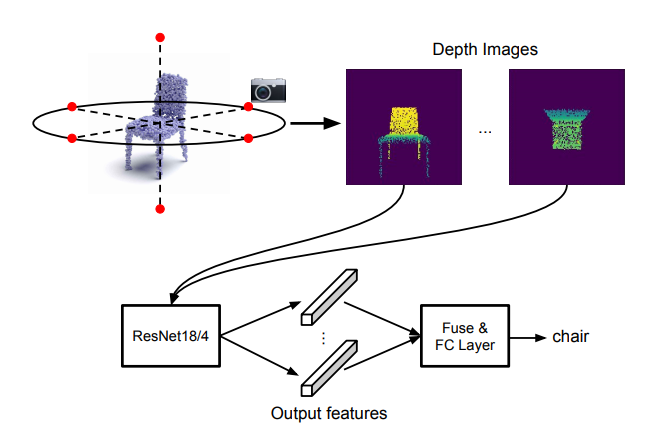

</img>

# simpleview-pytorch
PyTorch implementation of SimpleView from ["Revisiting Point Cloud Classification with a Simple and Effective Baseline"](https://openreview.net/forum?id=XwATtbX3oCz)

## Usage

```python
import torch
from simpleview_pytorch import SimpleView

model = SimpleView(
    num_views=6,
    num_classes=10
)

# depth 'images' generated from n views of point cloud
# [bs, n, c, h, w]
views = torch.randn(1, 6, 1, 128, 128)

model(views) # (1, 10)
```
